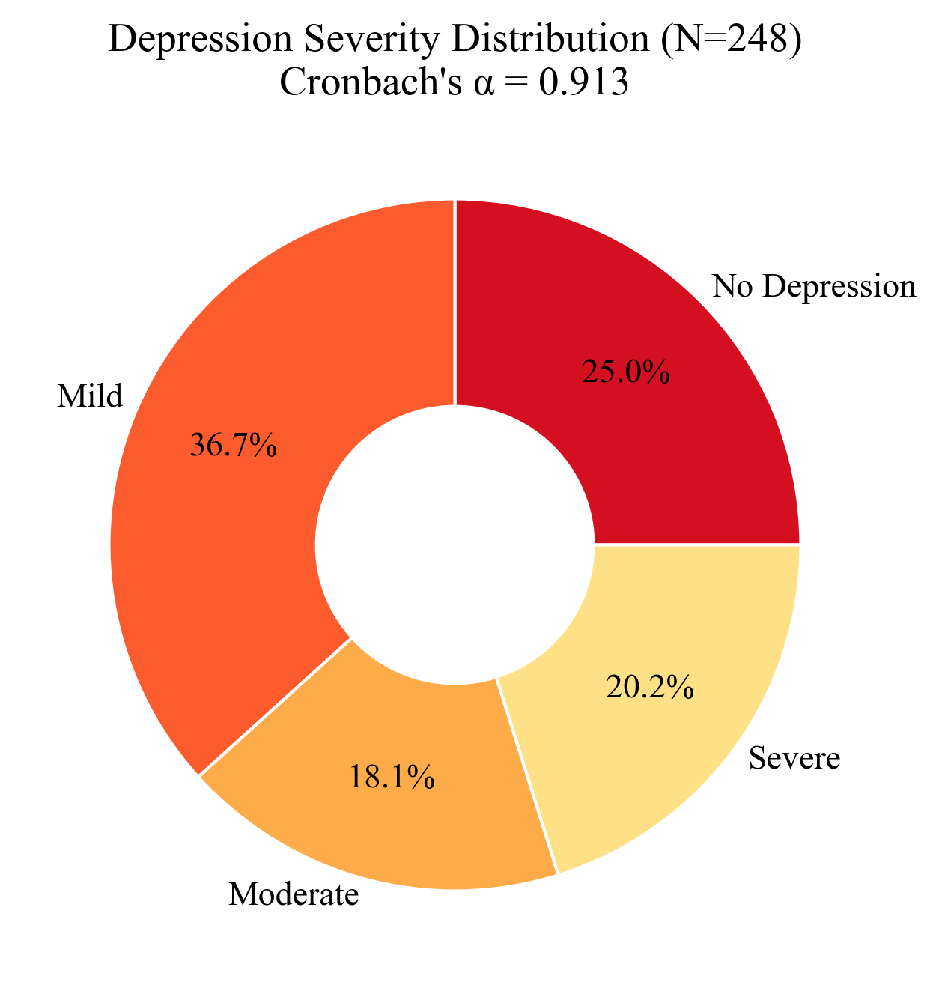
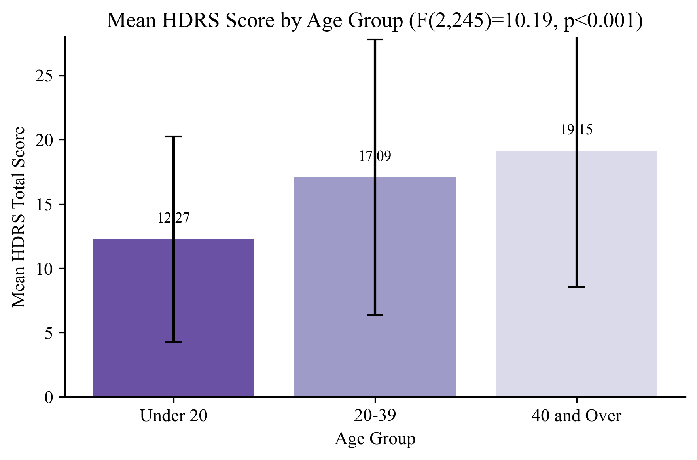
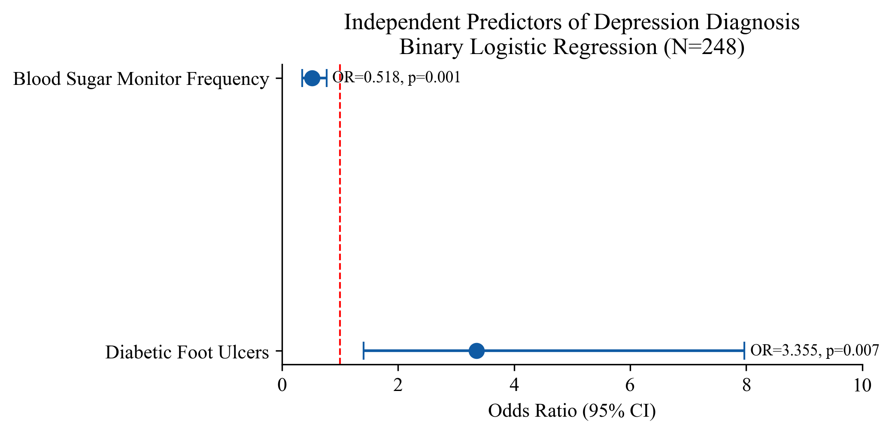

# Depression Among Type 1 Diabetes Patients — Atbra Teaching Hospital

## Nahr Al-Nil State, Sudan – 2025

**Study type:** Cross-sectional, hospital-based observational study

**Degree level:** MD (Clinical Medical Doctorate — Family Medicine, Sudan Medical Specializations Board)

**Institution:** Atbra Teaching Hospital, Aldamer, Nahr Al-Nil State

**Sample size:** N = 248 Type 1 diabetes patients

**Data analyst:** Abdulrahman Sirelkhatim

---

## Background

People with diabetes are two to three times more likely to develop depression
compared to the general population, yet fewer than half receive a diagnosis or
treatment. This bidirectional relationship creates a compounding burden:
depression reduces motivation for glycemic self-management, and poor control
worsens depressive outcomes.

In Sudan, access to mental health services is limited under normal conditions
and was further degraded by the armed conflict beginning in April 2023. Atbra
Teaching Hospital is one of the few functioning referral centres in Nahr Al-Nil
State, making its outpatient diabetes clinic a critical point of contact for a
vulnerable population. At the time of this study, no published data existed on
depression prevalence among Type 1 diabetes patients in this region.

## Objectives

- Estimate the prevalence of depression among Type 1 diabetes patients using the
Hamilton Depression Rating Scale (HDRS-17)
- Determine the severity distribution of depressive symptoms
- Identify sociodemographic, clinical, and complication-related risk factors for
depression
- Establish independent predictors of depression diagnosis and severity

## Study Design & Methods

| Component | Detail |
|-----------|--------|
| Design | Cross-sectional, hospital-based observational |
| Setting | Atbra Teaching Hospital outpatient diabetes clinic |
| Population | Type 1 diabetes patients aged 7–70, diagnosed ≥6 months prior |
| Sampling | Simple random sampling |
| Sample size calculation | Yamane formula (N=650, 95% CI, 5% margin of error) → n = 248 |
| Data collection | Structured interviewer-administered questionnaire (April–July 2025) |
| Depression instrument | Hamilton Depression Rating Scale (HDRS-17) |

**HDRS-17 cut-offs:**

| Score | Category |
|-------|----------|
| 0–7 | No depression |
| 8–16 | Mild depression |
| 17–24 | Moderate depression |
| ≥25 | Severe depression |

**Technical suite:**

| Tool | Purpose |
|------|---------|
| Python (pandas) | Data cleaning, HDRS score computation, binary variable creation |
| IBM SPSS Statistics v26 | Full statistical analysis |
| Python (matplotlib, seaborn, scipy) | Figure generation |
| Jupyter Notebook | Exploratory data analysis |

**Statistical methods:**

- **Reliability:** Cronbach's Alpha for HDRS-17 internal consistency
- **Descriptive:** Frequencies, percentages, means, SDs
- **Bivariate:** Chi-square (categorical variables vs. depression status),
independent samples t-test (HDRS by gender), one-way ANOVA with Bonferroni
post-hoc (HDRS by age group, duration group, education)
- **Correlation:** Pearson r (age, diabetes duration, HDRS total)
- **Multivariate:** Multiple linear regression (predictors of HDRS total score),
binary logistic regression (predictors of depression diagnosis)

## Dataset

| File | Description |
|------|-------------|
| `1_data/raw/raw_data.xlsx` | Raw questionnaire responses (sheet: "Form Responses 1") |
| `1_data/cleaned/cleaned_data.xlsx` | Cleaned dataset with numeric HDRS item scores, total score, binary depression status, severity category, age groups, duration groups, and complication binary variables |

> **Note:** This dataset contains patient data from a clinical setting. Raw data
is excluded from version control. The cleaned file retains no individual
identifiers.

## Repository Structure

```
depression-t1dm-atbra-2025/
│
├── README.md
├── .gitignore
│
├── 1_data/
│   ├── raw/                        ← excluded from version control (privacy)
│   └── cleaned/
│       └── cleaned_data.xlsx
│
├── 2_cleaning/
│   └── cleaning.py
│
├── 3_notebooks/
│   └── exploratory_analysis.ipynb
│
├── 4_analysis/
│   ├── full_analysis.sps
│   └── figures.py
│
├── 5_figures/
│   └── (15 figures)
│
└── 6_docs/
    └── results_chapter.docx
```

## Key Results

### Scale Reliability

Cronbach's Alpha = **0.913** for the HDRS-17, indicating excellent internal
consistency. Item-total correlations ranged from 0.36 to 0.80, except HDRS-17
(Insight, r = −0.06), which was retained to preserve the instrument's
conceptual integrity.

### Demographic Profile

Predominantly young (mean age 23.4 ± 12.8 years), male (54.8%), single (64.1%),
and student (51.2%). Most had primary or secondary education (67.7%).

### Clinical Profile

- 83.5% on insulin only; 16.5% on insulin + oral medication
- 60.5% reported always following their medication regimen
- 56.9% rated their glycemic control as good
- Only 3.6% monitored blood sugar daily; 35.5% did so rarely
- 85.5% reported no active complications; leading complications were foot ulcers (37.5%) and retinopathy (31.9%)

### Depression Prevalence and Severity

**75.0% of participants met criteria for depression (HDRS > 7)**:

| Severity | n | % |
|----------|---|---|
| No depression | 62 | 25.0% |
| Mild (8–16) | 91 | 36.7% |
| Moderate (17–24) | 45 | 18.1% |
| Severe (≥25) | 50 | 20.2% |

Mean HDRS total score: **15.15 ± 9.88** (range 0–43).

### Correlation Analysis

| Pair | Pearson r | p-value |
|------|-----------|---------|
| Age ↔ Diabetes Duration | 0.921 | < 0.001 |
| Age ↔ HDRS Total | 0.315 | < 0.001 |
| Diabetes Duration ↔ HDRS Total | 0.326 | < 0.001 |

### Key Bivariate Findings

- **Glycemic control:** 93.0% of patients with poor control were depressed vs. 61.0%
with good control (χ² p < 0.001)
- **Blood sugar monitoring:** Depression was highest in rare monitors (87.5%) and
lowest in daily monitors (22.2%) — a strong inverse trend (χ² p < 0.001)
- **Treatment type:** Insulin + oral medication group had 92.7% depression prevalence
vs. 71.5% for insulin only (p = 0.004)
- **Foot ulcers:** 91.4% of patients with foot ulcers were depressed (p < 0.001)
- **CVD:** 100% of patients with cardiovascular disease were depressed (p = 0.001)
- **Employment:** Housewives had the highest depression prevalence (90.9%); students the
lowest (67.7%) — p = 0.022
- **Age group:** Depression severity increased with age (F(2,245) = 10.19, p < 0.001)
- **Diabetes duration:** Severity increased significantly from 0–5 years (mean 11.60) to
over 15 years (mean 18.90) — F(2,245) = 11.67, p < 0.001

### Multiple Linear Regression — Predictors of HDRS Score

**Model fit:** F(15, 232) = 19.45, p < 0.001; Adjusted R² = **0.528**

| Predictor | β | p-value | Effect |
|-----------|---|---------|--------|
| Foot Ulcers | 0.432 | < 0.001 | +8.8 points |
| Blood Sugar Monitoring Frequency | −0.286 | < 0.001 | −2.9 per unit increase |
| CVD | 0.170 | 0.001 | +5.1 points |
| Retinopathy | 0.147 | 0.006 | +3.1 points |
| Doctor Check-up Frequency | 0.098 | 0.046 | +0.7 per unit increase |

### Binary Logistic Regression — Predictors of Depression Diagnosis

**Model performance:** χ²(15) = 59.65, p < 0.001; Nagelkerke R² = 0.317; correct classification = **77.8%**

| Predictor | OR | p-value | Interpretation |
|-----------|-----|---------|----------------|
| Diabetic Foot Ulcers | 3.355 | 0.007 | Foot ulcers increase depression odds by 3.4× |
| Blood Sugar Monitoring Frequency | 0.518 | 0.001 | Each unit increase in monitoring reduces odds by 48% |

> CVD was excluded from OR interpretation due to quasi-complete separation
(100% depression among CVD patients).

## Selected Figures

**Depression Severity Distribution**


**HDRS Score by Age Group**


**Independent Predictors — Forest Plot**


## Limitations

- **Cross-sectional design:** Cannot establish whether depression preceded poor glycemic control or vice versa.
- **Single-centre setting:** Results may not generalize to other Sudanese diabetes clinics.
- **Self-reported glycemic control:** No HbA1c laboratory values were available; glycemic control status reflects patient perception.
- **CVD quasi-separation:** The perfect association between CVD and depression (100%) caused unstable OR estimates in logistic regression; CVD effect was quantified through linear regression instead.
- **Age range:** Participants as young as 7 years old were included, which may affect HDRS item interpretation in children.

## Files

| Script | Purpose |
|--------|---------|
| `2_cleaning/cleaning.py` | Renames variables, extracts numeric scores from HDRS text responses, computes HDRS total, creates depression binary and severity variables, age/duration groups, complication flags |
| `3_notebooks/exploratory_analysis.ipynb` | EDA: data quality, demographic profile, HDRS distribution, key associations |
| `4_analysis/figures.py` | All 15 figures generated from cleaned data |
| `4_analysis/full_analysis.sps` | SPSS syntax: HDRS recoding, reliability, descriptives, chi-square, t-test, ANOVA with Bonferroni, Pearson correlation, linear and logistic regression |

---

**Data analyst:** *Abdulrahman Sirelkhatim | Analysis conducted October 2025*
